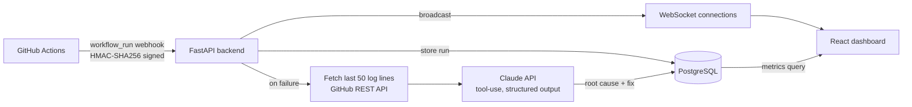
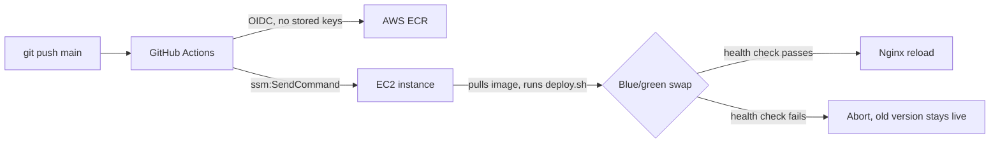

# BuildBoard

A self-hosted CI/CD monitoring platform. It ingests GitHub Actions webhook
events, computes build health metrics, uses Claude to explain why a build
failed, and pushes all of it to a live dashboard over WebSockets.

**Live:** [buildboard-siddhesh.duckdns.org](https://buildboard-siddhesh.duckdns.org)

## Screenshots

**Dashboard** — health score, pass rate, and average build time per repo, computed from real webhook history.


**Repo detail** — build duration trend, pass/fail history, and live updates over WebSockets (no refresh needed when a new build lands).


**Failure analysis** — on a failed build, the last 50 lines of CI logs are sent to Claude, which returns a structured root cause and suggested fix.


## Architecture



Deploy path:



## How it's built

A few decisions worth calling out, since they're the parts that don't show
up in a screenshot:

- **Health score is pass-rate first, duration second.** `health_score =
  pass_rate - duration_penalty`, where the penalty only kicks in if average
  build time is *trending worse* than the prior window (there's no universal
  "slow" threshold across repos), and is capped at 20 points so a
  100%-passing repo can only ever look "healthy but slower," never broken.
- **Claude analysis uses forced tool-use, not prompt-and-parse.** The
  `root_cause`/`suggested_fix` split is a JSON Schema tool call, not regex
  over free text — the API guarantees the shape instead of hoping the model
  stays on format.
- **Deploys are a real blue-green swap on a single free-tier EC2 instance,**
  not a restart with a fancier name: the new container starts on a spare
  port, gets health-checked against `/health` (not just a 200 — checks the
  DB connection specifically), and only then does Nginx flip traffic to it.
  A failed health check aborts and leaves the current version live — a bad
  image can't take the site down.
- **GitHub Actions never holds AWS or SSH credentials.** It assumes a
  narrowly-scoped IAM role over OIDC (short-lived, repo+branch locked) to
  push to ECR, then runs the deploy script via AWS SSM `send-command`
  instead of SSH — the EC2 security group has no port 22 open to the
  internet at all, only to one IP.
- **Webhook signatures are verified with HMAC-SHA256** using
  `hmac.compare_digest` (timing-safe) before any payload is trusted.

## Tech stack

| Layer | Choice |
|---|---|
| Backend | Python 3.11, FastAPI (async), SQLAlchemy, Alembic |
| Database | PostgreSQL (RDS in production) |
| Real-time | WebSockets, native FastAPI |
| AI | Claude API — Haiku for dev, Sonnet for demo |
| Frontend | React, TypeScript, Vite, Tailwind CSS, Recharts |
| Infra | Docker, AWS EC2 + RDS + ECR, Nginx, Let's Encrypt |
| CI/CD | GitHub Actions → ECR → SSM → blue-green deploy |

## Running locally

```bash
# Postgres
cd backend && docker compose up -d postgres

# Backend
cd backend
python3.11 -m venv venv && ./venv/bin/pip install -r requirements.txt
cp .env.example .env   # fill in DATABASE_URL, GITHUB_WEBHOOK_SECRET, etc. — AI_MOCK=true needs no API key
./venv/bin/alembic upgrade head
./venv/bin/uvicorn app.main:app --reload --port 8000

# Frontend
cd frontend
npm install
cp .env.example .env
npm run dev
```

`AI_MOCK=true` (the default) skips real Claude calls entirely — useful for
running the whole pipeline end-to-end without an API key or cost.

## API

```
POST /webhooks/github        GitHub webhook receiver (HMAC verified)
GET  /repos                  List monitored repos
GET  /repos/{id}/metrics     Health score, pass rate, flaky-build detection
GET  /repos/{id}/runs        Build history
GET  /runs/{id}               Single build detail
GET  /runs/{id}/analysis      Claude failure analysis
WS   /ws/{repo_id}           Live build updates
GET  /health                  Health check
```
