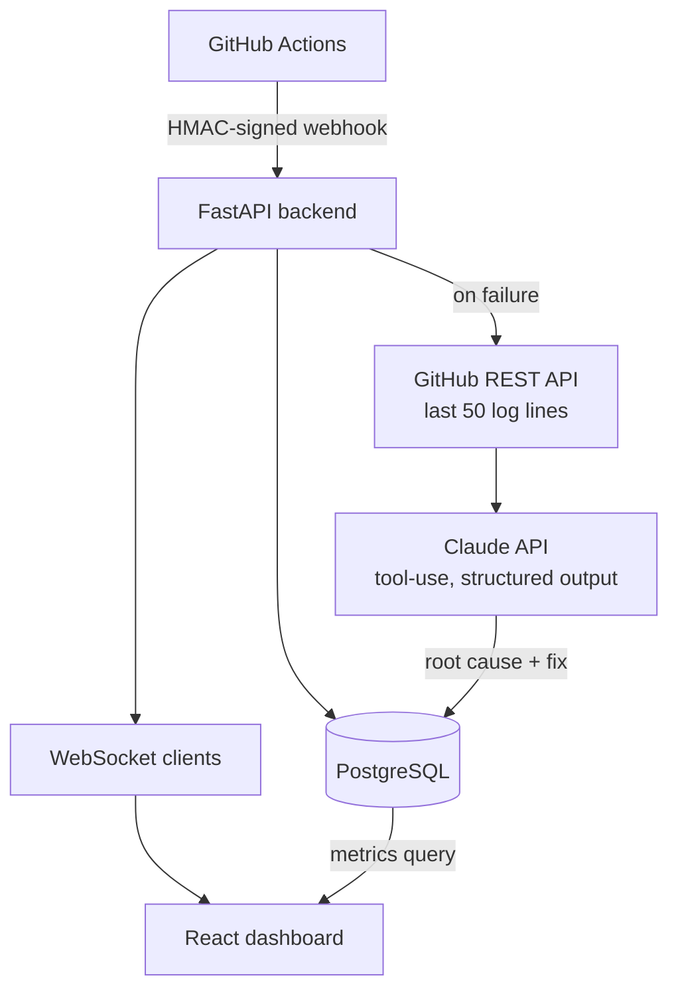
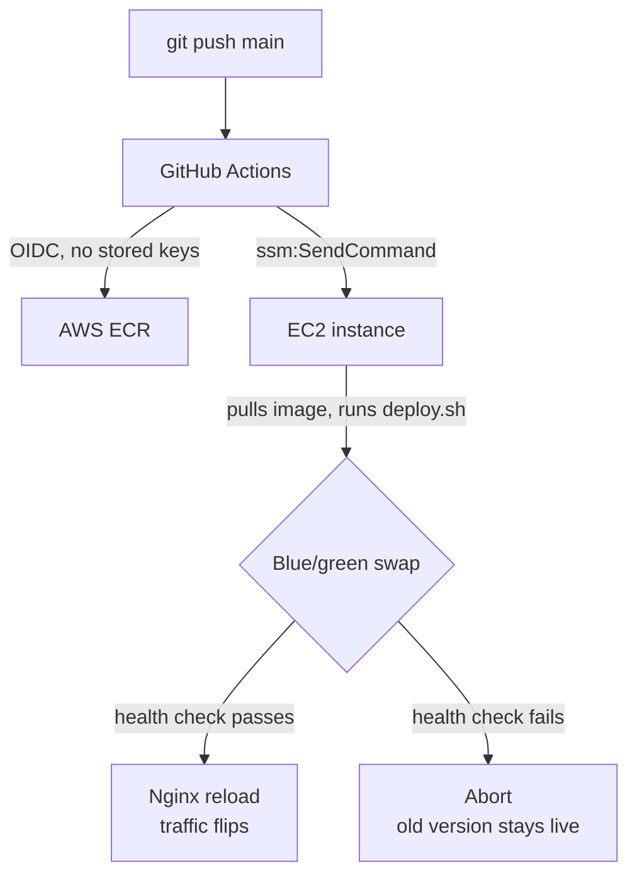

# BuildBoard


A self-hosted CI/CD monitoring platform: it ingests GitHub Actions webhook
events, computes build health metrics, uses Claude to explain *why* a build
failed, and pushes all of it to a live dashboard over WebSockets — no
polling, no refresh button.

**Live:** [buildboard-siddhesh.duckdns.org](https://buildboard-siddhesh.duckdns.org)

### Contents
[Why I built this](#why-i-built-this) · [Demo](#live-update-demo) · [Screenshots](#screenshots) · [Architecture](#architecture) · [Engineering decisions](#engineering-decisions) · [Tech stack](#tech-stack) · [Running locally](#running-locally) · [API](#api)

---

## Why I built this

Every team with a CI pipeline eventually asks the same three questions:
is it healthy, is it slow, and why did it just break. GitHub's own Actions
UI answers none of them well at a glance — you're clicking into individual
runs, reading raw logs, and re-deriving pass rate by eye.

I wanted something that treats build data as a time series instead of a
list of runs: a health score that reacts to *trends*, not just the latest
result; live updates the moment a build finishes, not on refresh; and for
failures, an actual explanation instead of a wall of stack trace.

It's also, deliberately, a vertical slice through a real production stack —
signed webhooks, an async API, a real-time layer, a third-party LLM
integration, containerization, and a CI/CD pipeline that deploys itself.
Every piece is there because the system needed it, not because it looked
good on a list.

## Live update demo

A commit lands on GitHub, Actions runs it, and the dashboard updates itself
— no reload. This is a real webhook round-trip, not a simulated animation:
a build history row and both charts pick up the new run the moment the
backend broadcasts it over WebSocket.


## Screenshots

**Dashboard** — health score, pass rate, and average build time per repo, computed from real webhook history.


**Repo detail** — build duration trend, pass/fail history, and live updates over WebSockets (no refresh needed when a new build lands).


**Failure analysis** — on a failed build, the last 50 lines of CI logs are sent to Claude, which returns a structured root cause and suggested fix.


---

## Architecture

**Event flow** — a webhook arriving to a metric change on screen:



**Deploy path** — a push to `main` reaching production with zero downtime:



---

## Engineering decisions

These are the parts that don't show up in a screenshot — the tradeoffs I
actually made and why, not the tradeoffs a tutorial would tell you to make.

### Webhook ingestion
GitHub signs every webhook payload with HMAC-SHA256 over the raw request
body. The signature is verified with `hmac.compare_digest` — a
constant-time comparison — before the payload is trusted at all, so a
timing attack can't be used to guess the secret byte by byte.

GitHub also sends **three separate deliveries per run** (`requested` →
`in_progress` → `completed`). Rather than treating those as three events,
the handler finds-or-creates a single `WorkflowRun` row keyed on GitHub's
`run_id` and updates it in place — so a run's row shows its live status
through its whole lifecycle instead of producing duplicate rows.

### Health score
```
health_score = pass_rate − duration_penalty
```
Pass rate excludes cancelled/skipped runs from both sides of the ratio —
those were never actually tested to completion, so counting them as
failures would punish a repo for someone hitting cancel, not for broken
code.

The duration penalty is scored by **trend**, not an absolute threshold:
current window's average build time vs. the prior equal-length window.
There's no universal "slow" — a monorepo's test suite and a one-file lint
check have nothing in common — so an absolute cutoff would be arbitrary.
The penalty is capped at 20 points, because pass/fail is the real
broken-vs-working signal; a worsening duration trend should make a
100%-passing repo look "healthy but slower," never make it look broken.

A repo with zero data in the window returns `null`, not `0` — "no data
yet" and "unhealthy" are different states and the UI treats them
differently (an em dash vs. a red badge), not the same defaulted number.

### Flaky build detection
Runs are grouped by `(branch, commit_sha)`; a group containing both a
`success` and a `failure` conclusion gets flagged. The reasoning: if the
exact same commit produced both outcomes with no code change in between,
non-determinism is the most likely explanation, not a bug that got fixed
mid-flight.

**Known limitation, left in on purpose:** GitHub's "re-run failed jobs"
reuses the same `run_id`, and the webhook handler updates that row in
place (by design — see above) — so the original failure gets silently
overwritten by the re-run's success before flaky detection ever sees two
conclusions for the same row. Catching that would mean storing
`run_attempt` and inserting a new row per attempt instead of updating in
place — a real schema change I chose not to make, because flaky detection
is a secondary metric and re-architecting the run-storage model to catch
a footnote wasn't worth the time against everything else left to build.
I'd make that call differently if this were a system other engineers
depended on.

### Claude integration
The failure analysis needs two independent fields — root cause and
suggested fix — stored in two separate database columns. Prompting for
JSON and parsing the response is fragile (the model can wrap it in prose,
use inconsistent keys, or just get it wrong). Instead, the call uses
**forced tool-use**: a JSON Schema tool definition with both fields
required, and `tool_choice` forcing the model to call it. The API
guarantees the shape — there's no regex, no "did it actually return valid
JSON this time."

Only the **last 50 lines** of logs are sent, for two reasons that aren't
just "tokens cost money": CI logs are mostly setup noise and the actual
error is almost always at the tail, and burying 10 relevant lines inside
thousands of lines of successful output dilutes the signal for the model
itself, not just the bill.

Every code path checks an `AI_MOCK` flag *before* constructing the
Anthropic client, so a placeholder API key during development can never
trigger a real network call by accident. Mock responses are prefixed
`[MOCK]` in both fields, so mocked output can never be mistaken for a
real one downstream.

### Background work vs. inline work
Fetching logs and calling Claude happen in a `BackgroundTasks` job — the
webhook handler responds to GitHub immediately and does the slow work
after. GitHub expects a timely response; blocking on two external API
calls risks the delivery being marked failed. WebSocket broadcasts, by
contrast, are awaited inline — the distinguishing question is "is this
slow/external," not "is this async," and broadcasting to already-open
local connections is fast in-process I/O.

The background task is also guarded against **duplicate webhook
deliveries** (GitHub redelivers on suspected timeout): it checks for an
existing `FailureAnalysis` row for the run before doing any work, so a
redelivered event can't trigger a second paid API call or a duplicate row.

### Real-time layer
A single in-process `ConnectionManager` keyed by `repo_id` holds active
WebSocket connections and broadcasts only to viewers of the relevant repo.
This is deliberately in-memory and single-instance — correct for this
project's actual deployment shape (one EC2 instance, no load balancer),
but it's a real scaling limit I'd swap for Redis pub/sub if this ever ran
behind more than one backend instance.

### Containerization
The Dockerfile is a multi-stage build: dependencies install via `pip
install --user` in a builder stage, and only the installed packages plus
application code get copied into the final image — not the build cache.
Every `FROM` is pinned to `--platform=linux/amd64` unconditionally, which
Docker's own linter flags as non-portable — correct in general, but wrong
advice here: this image only ever runs on one target (an x86_64 EC2
instance), built from an Apple Silicon Mac where Docker would otherwise
silently emulate the wrong architecture and only fail once deployed.

### Infrastructure & IAM
Everything on AWS runs under a purpose-scoped IAM identity, not
`AdministratorAccess` — a CLI user with EC2/RDS/ECR permissions only, and
a separate EC2 instance role (ECR read-only) so the server can pull
images without any credential file stored on disk. RDS accepts
connections only from the EC2 security group, never the public internet.
Least-privilege isn't free: it meant hitting real permission walls while
building this (see below) and working around them deliberately instead
of reaching for broader access.

### CI/CD pipeline
On push to `main`, GitHub Actions builds the image, pushes to ECR, and
deploys — with two constraints that shaped the whole pipeline:

- **No long-lived AWS credentials in GitHub.** The workflow assumes an
  IAM role via OIDC — a short-lived token scoped to exactly
  `repo:this-repo:ref:refs/heads/main` — instead of static access keys
  sitting in repo secrets.
- **No open SSH port.** The EC2 security group locks port 22 to one IP
  (mine), which GitHub's hosted runners can't satisfy since they connect
  from rotating IP ranges. Rather than opening SSH to the internet, the
  deploy step runs the deploy script via `aws ssm send-command` — an
  authenticated AWS API call through the instance's own IAM role, with no
  inbound port exposed at all.

Deploys themselves are a **real blue-green swap**, not a restart with a
fancier name: the new container starts on a spare port, gets health-
checked against `/health` — checking the database connection
specifically, not just a 200 — and only then does Nginx flip traffic to
it with a graceful reload (in-flight requests finish against the old
upstream instead of being dropped). A failed health check aborts,
deletes the bad container, and leaves the currently-live version
untouched — a broken image can't take the site down.

Two real bugs surfaced building this and are worth naming rather than
glossing over: GitHub's OIDC tokens now embed immutable owner/repo IDs in
the `sub` claim by default (`repo:owner@id/repo@id:...`), which broke the
trust policy every OIDC tutorial assumes and needed a wildcard match
instead of an exact one; and the SSH-vs-SSM pivot above was diagnosed by
watching the actual TCP timeout, not guessed at from documentation.

---

## Tech stack

| Layer | Choice | Why |
|---|---|---|
| Backend | Python 3.11, FastAPI | Async I/O for concurrent webhook handling + WebSocket connections without a separate worker model |
| ORM / migrations | SQLAlchemy 2.0, Alembic | Versioned schema changes, not hand-run SQL against production |
| Database | PostgreSQL (RDS in prod) | Relational data with real foreign keys (repos → runs → analyses); managed RDS over self-hosting for backups/patching |
| Real-time | Native FastAPI WebSockets | No separate real-time service needed at this scale |
| AI | Claude API (Haiku dev / Sonnet demo) | Forced tool-use for structured output; model swappable via one env var |
| Frontend | React, TypeScript, Vite, Tailwind, Recharts | Typed API contracts end-to-end; Vite for fast iteration |
| Containers | Docker, multi-stage builds | Identical artifact from a laptop to production |
| Infra | AWS EC2, RDS, ECR, Nginx, Let's Encrypt | Free-tier-covered, no managed services that cost money idle (ELB, NAT Gateway explicitly avoided) |
| CI/CD | GitHub Actions, OIDC, AWS SSM | No long-lived credentials anywhere in the pipeline |

---

## Running locally

```bash
# Postgres
cd backend && docker compose up -d postgres

# Backend
cd backend
python3.11 -m venv venv && ./venv/bin/pip install -r requirements.txt
cp .env.example .env   # DATABASE_URL, GITHUB_WEBHOOK_SECRET, etc. — AI_MOCK=true needs no API key
./venv/bin/alembic upgrade head
./venv/bin/uvicorn app.main:app --reload --port 8000

# Frontend
cd frontend
npm install
cp .env.example .env
npm run dev
```

`AI_MOCK=true` (the default) skips real Claude calls entirely, so the
whole pipeline runs end-to-end with no API key and no cost.

## API

```
POST /webhooks/github        GitHub webhook receiver (HMAC verified)
GET  /repos                  List monitored repos
GET  /repos/{id}/metrics     Health score, pass rate, flaky-build detection
GET  /repos/{id}/runs        Build history
GET  /runs/{id}               Single build detail
GET  /runs/{id}/analysis      Claude failure analysis
WS   /ws/{repo_id}           Live build updates
GET  /health                  Health check
```
