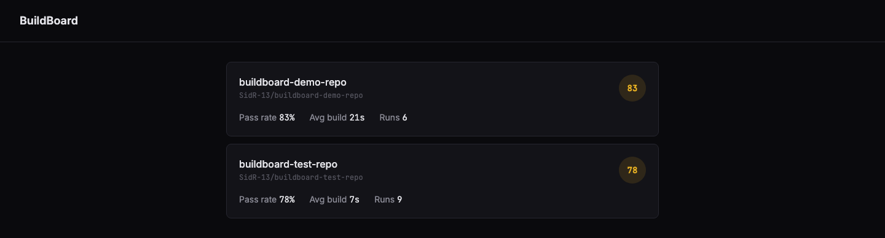
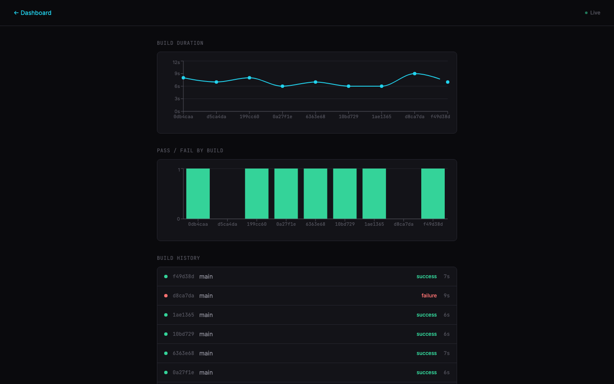
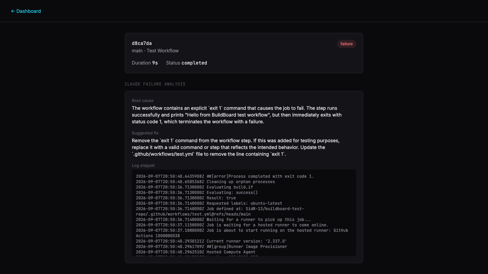
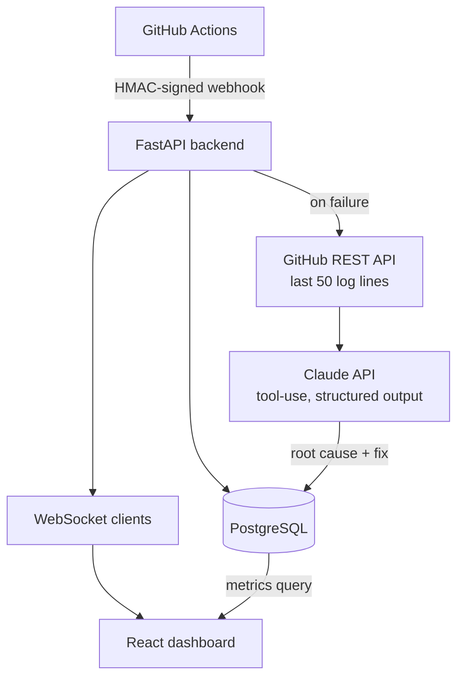
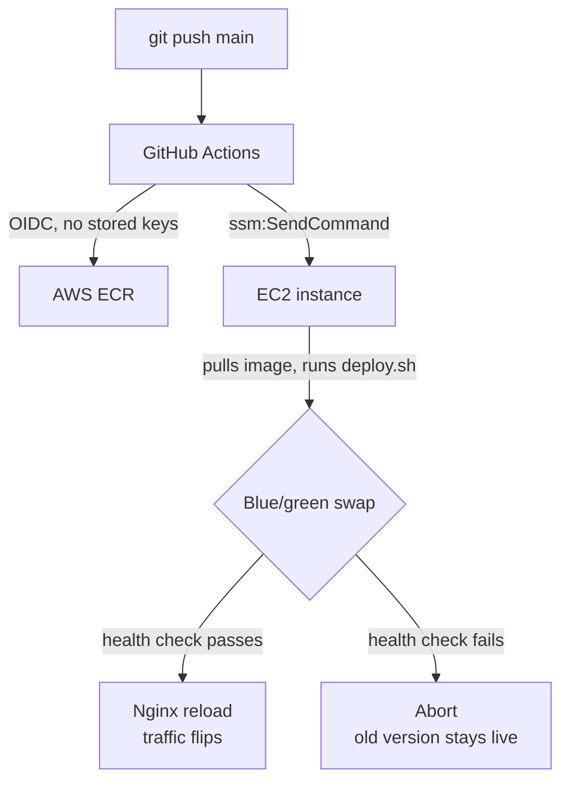

# BuildBoard


A self-hosted CI/CD monitoring platform: it ingests GitHub Actions webhook
events, computes build health metrics, uses Claude to explain *why* a build
failed, and pushes all of it to a live dashboard over WebSockets — no
polling, no refresh button.

**Live:** [buildboard-siddhesh.duckdns.org](https://buildboard-siddhesh.duckdns.org)
— the real deployment. It'll show "No repos yet" since no GitHub repo's
webhook currently points at production (the screenshots and demo below are
from a local instance with real accumulated build history instead, so
there's something to actually look at).

### Contents
[Why I built this](#why-i-built-this) · [Demo](#live-update-demo) · [Screenshots](#screenshots) · [Architecture](#architecture) · [Engineering log](#engineering-log) · [Limitations](#limitations--path-to-scale) · [Tech stack](#tech-stack) · [AWS infrastructure](#aws-infrastructure) · [Running locally](#running-locally) · [API](#api)

---

## Why I built this

Every team with a CI pipeline eventually asks the same three questions:
is it healthy, is it slow, and why did it just break. GitHub's own Actions
UI answers none of them well at a glance — you're clicking into individual
runs, reading raw logs, and re-deriving pass rate by eye.

I wanted something that treats build data as a time series instead of a
list of runs: a health score that reacts to *trends*, not just the latest
result; live updates the moment a build finishes, not on refresh; and for
failures, an actual explanation instead of a wall of stack trace.

It's also, deliberately, a vertical slice through a real production stack —
signed webhooks, an async API, a real-time layer, a third-party LLM
integration, containerization, and a CI/CD pipeline that deploys itself.
Every piece is there because the system needed it, not because it looked
good on a list.

## Live update demo

A commit lands on GitHub, Actions runs it, and the dashboard updates itself
— no reload. This is a real webhook round-trip, not a simulated animation:
a build history row and both charts pick up the new run the moment the
backend broadcasts it over WebSocket.


## Screenshots

**Dashboard** — health score, pass rate, and average build time per repo, computed from real webhook history.



**Repo detail** — build duration trend, pass/fail history, and live updates over WebSockets (no refresh needed when a new build lands).



**Failure analysis** — on a failed build, the last 50 lines of CI logs are sent to Claude, which returns a structured root cause and suggested fix.



---

## Architecture

**Event flow** — a webhook arriving to a metric change on screen:



**Deploy path** — a push to `main` reaching production with zero downtime:



---

## Engineering log

I built this with an AI pair-programmer (Claude) doing a lot of the typing
and a fair amount of the debugging legwork — that's disclosed here, not
hidden, because it's an honest description of how the code got written.
What it didn't do is make the calls: every tradeoff below is one I decided,
usually after being walked through the options, sometimes after rejecting
the AI's first take. The entries are in build order, kept to the ones that
actually involved a decision or a real bug, not a changelog of every file
touched.

**Webhook lifecycle → one row, not three.**
GitHub sends three separate deliveries per workflow run —
`requested` → `in_progress` → `completed` — not one. First instinct was to
store each as its own row; decided against it once I realized that's not
"history," it's the same run's status flickering three times in the table.
Handler now finds-or-creates a single row keyed on GitHub's `run_id` and
updates it in place, so a run has one identity through its whole lifecycle.
Signature verification (HMAC-SHA256, `hmac.compare_digest` — constant-time,
so timing can't leak the secret) went in from the first version, not bolted
on after; an unauthenticated webhook endpoint accepting arbitrary POSTs
wasn't a version I wanted to ship even for a portfolio project.

**Health score: fought the urge to pick an arbitrary "slow" threshold.**
First draft docked points for any build over some fixed number of seconds.
Killed it before writing it — a monorepo's test suite and a one-file lint
check have nothing in common, so any fixed threshold is just a number I
made up. Landed on scoring build duration by *trend* (this window vs. the
prior one) instead, capped at a 20-point penalty so a flaky-slow week can
soften a passing score but never make a healthy repo read as broken.
Pass/fail rate stays the dominant signal on purpose.

**Flaky-build detection: shipped a known gap instead of over-building.**
Detection groups runs by `(branch, commit_sha)` and flags any group with
both a success and a failure — same commit, two outcomes, most likely
non-determinism. Then found the real gap: GitHub's "re-run failed jobs"
reuses the same `run_id`, and my webhook handler updates that row in place
(the same design decision from the first entry), so a re-run silently
overwrites the original failure before detection ever sees both outcomes.
Fixing it properly means storing `run_attempt` and inserting a new row per
attempt — a real schema change. I explicitly asked myself whether I was
overcomplicating the project chasing a metric that doesn't even appear in
the interview pitch, decided the answer was yes, and documented the
limitation instead of building around it. I'd make the opposite call on a
system other engineers actually relied on.

**A GitHub PAT that "existed" but didn't work.**
Claude API log-fetching returned 401s on the first real test. My check had
confirmed `GITHUB_TOKEN` was *set* in `.env` — it just so happened to still
be the literal placeholder string from `.env.example`, and I'd read
"present" as "valid" without actually looking at the value. Confirmed the
real cause by running the same request with `gh`'s own token side-by-side
and watching it succeed where mine failed. Fix was a fresh, narrowly-scoped
fine-grained PAT (read-only, one repo) — kept deliberately separate from
`gh`'s own broader token rather than reusing it.

**A debug print that "didn't run" — until stdout buffering did.**
Building the WebSocket connection registry, I added temporary print
statements to watch it from inside the running process (a separate script
can't see another process's memory). First run: nothing printed, despite
the code clearly executing on every other check I ran. Root cause was
Python block-buffering stdout once it's piped to a file, not a logic bug —
fixed by confirming with `flush=True`, then removed the debug prints and
explicitly re-ran the full test against the *cleaned-up* code, because
"it worked before I removed the prints" isn't the same claim.

**Proved the container networking story instead of asserting it.**
Docker container-to-container traffic goes over the service name, not
`localhost` — I knew that going in, but the compose file's `DATABASE_URL`
still pointed at `localhost:5432` (correct for host-run dev, wrong from
inside a container). Rather than just fixing it and moving on, I exec'd
into the running backend container and manually attempted a raw socket
connection to `localhost:5432` from inside it, watched it fail with
`Connection refused`, then resolved the service-name hostname to confirm
where the real listener was. Wanted the explanation to survive being
asked "how do you know," not just sound right.

**Least-privilege IAM meant hitting real walls, on purpose.**
The AWS CLI identity for this project has EC2/RDS/ECR permissions and
nothing else — deliberately, not `AdministratorAccess`. That choice has a
cost: creating the EC2 instance's IAM role hit an access-denied wall
(a scoped-down identity can't grant IAM permissions, including to itself),
so that one step had to go through the AWS console under the account
owner instead of the CLI. Then attaching the finished role to the instance
hit a *second*, different wall — `iam:PassRole`, a separate AWS guardrail
against using a role to escalate your own privileges — fixed with one
narrow inline grant scoped to that single role's ARN, not IAM broadly. Two
walls in a row is annoying to debug through; it's also exactly what
least-privilege is supposed to do, and I'd rather hit it while building
than not have it at all.

**The project didn't have a real GitHub repo — until CI/CD needed one.**
Batches 0 through 10 existed only as local files; only a disposable test
fixture had ever been pushed to GitHub. Starting the CI/CD pipeline meant
starting with `git init`, a `.gitignore` for a nested test-fixture repo,
and a private `SidR-13/buildboard` repo — infrastructure work the batch
plan didn't call out, discovered by trying to write a workflow file and
having nowhere to put it.

**OIDC trust denied — diagnosed by reading the actual token, not the docs.**
Wired up GitHub Actions to assume an AWS role via OIDC so no AWS keys
would live in repo secrets. It failed with `Not authorized to perform
sts:AssumeRoleWithWebIdentity` even though the trust policy visually
matched every OIDC tutorial's example. Instead of guessing, I added a
throwaway workflow step that fetched GitHub's real ID token and decoded
its JWT payload to stdout. That showed the actual cause: GitHub now embeds
immutable owner/repo IDs in the `sub` claim by default —
`repo:owner@id/repo@id:ref:...` — a format no tutorial assumes because it's
newer than most of them. Fixed with a wildcard match in the trust policy,
then deleted the debug step once confirmed.

**A security group correctly blocked my own deploy — didn't weaken it to fix that.**
The deploy step's first version SSH'd into EC2, and failed with a TCP
timeout. Root cause: the EC2 security group intentionally locks port 22 to
my own IP, and GitHub's hosted runners connect from rotating ranges — the
firewall was doing exactly its job. The easy fix was opening port 22 to
the internet; I didn't take it. Pivoted the whole deploy step to AWS
Systems Manager instead — `ssm:SendCommand` runs the deploy script over an
authenticated AWS API call through the instance's own IAM role, so port 22
never has to open at all. More moving parts, but the security posture I'd
already decided on stayed intact instead of getting quietly walked back
under deadline pressure.

**Blue-green over "restart with extra steps."**
The batch plan called for a "zero-downtime rolling update" on a single
free-tier EC2 instance — no load balancer, no second server. Restart-based
deploys would have a real (if brief) gap where the site is down; I decided
that didn't actually satisfy the requirement, even though it's the fastest
thing to build. Went with an actual blue-green swap instead: the new
container starts on a spare port, gets health-checked against `/health`
— checking the database connection specifically, not just a 200 — and
only then does Nginx flip traffic to it with a graceful reload. A failed
health check aborts and leaves the current version live; a bad image
can't take the site down.

**Shipped the real Claude output, not the mock, in the README.**
Writing this file, the failure-analysis screenshot showed `[MOCK] Build
failed - AI_MOCK=true, no real analysis performed` — accurate for local
dev, but it undersells the actual feature to anyone reading this. Rather
than pass it off as-is, I flipped `AI_MOCK` off locally for exactly one
real Claude call against a real failed build, captured that, and flipped
it back — the $1.50 project budget accounted for demo-purpose calls like
this from the start. Same standard applied to the dashboard screenshot: it
had one real repo in it and looked sparse, so I registered a second real
GitHub repo with its own webhook and build history rather than fake a
fuller-looking dashboard.

**Deploying the frontend surfaced a routing collision I hadn't hit yet.**
Building the Vite app and pointing Nginx at the static files seemed
mechanical — until I actually laid out the routes side by side. The
frontend's client-side route `/runs/:runId` and the backend's
`GET /runs/{id}` are the *same URL* once both are served from one domain:
one should return the SPA shell, the other a JSON body, and Nginx has no
way to tell those two intentions apart for an identical path. Considered
disambiguating by request `Accept` header — fragile, and it wouldn't hold
up if a browser tab was ever refreshed directly on a build-detail page.
Instead namespaced the entire API under `/api` (a small, mechanical
change to the route registration, not a redesign) and gave Nginx three
unambiguous rules: `/api/*` proxies to the backend, `/health` proxies too
(nothing in the frontend ever routes there, so it stays put), and
everything else falls through to the SPA with a `try_files ... /index.html`
fallback so a direct load or refresh on `/repos/:id` still works. Tested
the exact failure mode this fixes — a hard refresh on a deep link — before
calling it done, not just the happy path from `/`.

**Wiring the frontend into CI/CD needed a file-transfer path SSM doesn't
have.** The backend's deploy step already worked over `ssm:SendCommand` —
but that only runs shell commands on the instance, it can't push files to
it. Getting the built frontend from a GitHub Actions runner onto EC2
needed an intermediary, so I added a private S3 bucket: the workflow
uploads the build there, then an SSM command tells the instance to pull
it down with `aws s3 sync`. Split the single deploy job into a small
dispatcher job (diffs the push, decides whether backend, frontend, or
both actually changed) plus two independent jobs, so a frontend-only
commit no longer rebuilds and redeploys the backend image for nothing.
First real run failed twice before working — once on a bucket that
didn't exist yet, once on a missing IAM grant for the GitHub Actions role
— both fixed by reading the actual error rather than re-guessing the
whole setup, same as every other AWS wall this project hit.

---

## Limitations & path to scale

This is a solid single-service vertical slice, built and operated by one
person — it is not what a team-run version of this would look like. Listed
roughly in the order each would actually bite:

**No automated tests.** Every feature in this README was verified by hand
against real webhook data — real verification, but not repeatable, and it
doesn't gate anything in CI. A team-run version needs `pytest` coverage on
the metrics math (health score, flaky detection) and the webhook
signature/idempotency logic at minimum, wired into the GitHub Actions
workflow as a check the image has to pass before it's even built.

**No authentication.** Every endpoint and the dashboard are open to
anyone with the URL. `JWT_SECRET` is already sitting in the env file —
provisioned, never wired into anything. Real multi-tenant use needs actual
user accounts and repo-level access control, not just an API key bolted
onto an otherwise-open API.

**In-memory WebSocket registry, single instance only.** Covered in the
engineering log above: the connection registry lives in one process's
memory, which only works because this runs on exactly one EC2 instance
with no load balancer. Two backend instances would each hold half the
connections with no way to know about builds routed to the other — the
standard fix is Redis pub/sub, publish on webhook, every instance
subscribes and fans out to its own local connections.

**Metrics are recomputed live, with no caching and no indexes.** `REDIS_URL`
is defined in config and never actually used — health score and pass rate
are a fresh SQL aggregation on every dashboard load, over tables with no
indexes beyond the primary key. Fine at today's data volume; years of
build history would need an index on `(repo_id, started_at)` at minimum,
plus caching computed metrics with invalidation on new webhook events
instead of recomputing per request.

**`BackgroundTasks` isn't a task queue.** Claude analysis and log fetching
run in-process via FastAPI's `BackgroundTasks` — no retry on failure, no
persistence if the process restarts mid-task, and no scaling independent
of the web server. A real deployment moves this to Celery/RQ/SQS, so a
burst of failing builds doesn't compete with the API for the same
process's CPU, and a crashed analysis job doesn't just silently disappear.

**No rate limiting on the webhook endpoint.** HMAC verification stops
forged payloads, not volume — a misconfigured sender could still hit
`/webhooks/github` as fast as it wants. Needs a rate limiter, or ingestion
moved behind a queue (SQS) so bursts queue instead of loading the API
directly.

**Secrets live in a `.env` file on the instance**, not a managed secret
store. Works for one server updated by hand; a team needs AWS Secrets
Manager or Parameter Store for rotation and an audit trail instead of a
file someone has to remember to update.

**No observability beyond a billing alarm.** The only alarm in this
project watches AWS spend, not application health — no structured logs
shipped anywhere queryable, no error tracking, no alerting on webhook
processing failures, failed deploys, or Claude API errors. This could run
unattended for a demo; it couldn't run unattended for a team.

**Deploy targets one hardcoded instance, not a fleet.** The CI/CD
pipeline's SSM command names one specific EC2 instance ID. Fine for a
single free-tier box; real scale-out replaces the blue-green-on-one-box
script with an ECS/EKS rolling deployment or an ASG behind a load
balancer — which would also require fixing the in-memory WebSocket
registry above first, since a fleet can't share one process's memory.

None of these are things I didn't think of — they're the parts I
consciously deferred to keep this project's scope realistic for one person
to actually finish, documented instead of left for someone to discover the
hard way.

---

## Tech stack

| Layer | Choice | Why |
|---|---|---|
| Backend | Python 3.11, FastAPI | Async I/O for concurrent webhook handling + WebSocket connections without a separate worker model |
| ORM / migrations | SQLAlchemy 2.0, Alembic | Versioned schema changes, not hand-run SQL against production |
| Database | PostgreSQL (RDS in prod) | Relational data with real foreign keys (repos → runs → analyses); managed RDS over self-hosting for backups/patching |
| Real-time | Native FastAPI WebSockets | No separate real-time service needed at this scale |
| AI | Claude API (Haiku dev / Sonnet demo) | Forced tool-use for structured output; model swappable via one env var |
| Frontend | React, TypeScript, Vite, Tailwind, Recharts | Typed API contracts end-to-end; Vite for fast iteration |
| Containers | Docker, multi-stage builds | Identical artifact from a laptop to production |
| Infra | AWS EC2, RDS, ECR, Nginx, Let's Encrypt | Free-tier-covered, no managed services that cost money idle (ELB, NAT Gateway explicitly avoided) |
| CI/CD | GitHub Actions, OIDC, AWS SSM | No long-lived credentials anywhere in the pipeline |

## AWS infrastructure

Every AWS service here is doing a specific job, not just "because AWS" —
this is what's actually running and the alternative each choice was made
over.

| Service | Used for | Why this, not the alternative |
|---|---|---|
| **EC2** (t2.micro) | Runs the backend container | Needed one long-lived process holding an in-memory WebSocket connection registry (see [Engineering log](#engineering-log)) — Lambda would mean either a stateless-WebSocket workaround via API Gateway + an external store, or paying for infrastructure this project doesn't need at its actual scale. One always-on free-tier instance is simpler and free for 12 months. |
| **RDS** (db.t3.micro, PostgreSQL) | Production database | Managed backups and patching over a self-hosted Postgres container — the tradeoff a solo operator should take, since "I'll remember to back it up" isn't a real backup strategy. Multi-AZ / read replicas explicitly skipped (see [Limitations](#limitations--path-to-scale)) — real cost for redundancy this project's traffic doesn't justify yet. |
| **ECR** | Private Docker image registry | Integrates with IAM directly — no separate registry credentials to manage or leak. Images are tagged by commit SHA, not just `:latest`, so a bad deploy has an exact rollback target. |
| **IAM** — three separate identities | Access control | A CLI user scoped to EC2/RDS/ECR only (not `AdministratorAccess`); a separate EC2 instance role, ECR-read-only, so the server can pull images with zero credential files on disk; a separate GitHub Actions OIDC role, trusted only for this repo's `main` branch, permissioned for ECR push + one SSM command on one instance. None of the three can do what the other two can — a compromised GitHub Actions run can't touch RDS, and a compromised EC2 instance can't push new images to ECR. |
| **Security groups** | Network boundary | EC2: port 22 open only to one IP (mine), 80/443 public. RDS: port 5432 open only to EC2's security group — never the public internet. Modeled as service-to-service trust, not "anything on the VPC can reach the database." |
| **Systems Manager (SSM)** | Runs the deploy scripts on EC2 | Chosen specifically so port 22 could stay locked to one IP — GitHub's hosted runners connect from rotating ranges that a single-IP rule can't allow-list. `ssm:SendCommand` runs each deploy over an authenticated AWS API call through the instance's own IAM role instead, so there's no SSH key in GitHub Actions and no open port for it to use anyway. |
| **S3** (private bucket) | Transfer point for frontend deploys | SSM runs commands, not file transfers — this is how the built frontend actually gets from a GitHub Actions runner onto EC2. GitHub Actions can only write to it; the EC2 role can only read from it — neither side has more access than the one direction it needs. |
| **Elastic IP** | Stable public address | EC2's default public IP changes on stop/start; DNS (below) needs something fixed to point at. |
| **Nginx + Let's Encrypt (Certbot)** | TLS termination, reverse proxy | Free HTTPS, and one config file handles both the WebSocket upgrade headers and the HTTP→HTTPS redirect. An ALB + ACM certificate would do the same job for ~$16/month this project doesn't need to spend. |
| **DuckDNS** | Domain name | Let's Encrypt can't issue a certificate for a bare IP — that's a protocol rule, not an AWS limitation. A free dynamic-DNS hostname was enough; buying a domain wasn't. |
| **CloudWatch billing alarm** | Spend safety net | Set up *before* any other AWS resource existed, on a personal card — cheap insurance against a misconfiguration running up a bill overnight. |

**Deliberately not used:** an Elastic Load Balancer and a NAT Gateway
(~$16/mo and ~$32/mo respectively, for redundancy/networking this single-
instance project doesn't have a use for) and ElastiCache — Redis is
provisioned in the app's config but never actually wired in (see
[Limitations](#limitations--path-to-scale)), so paying for a managed Redis
instance nobody calls would be pure waste.

---

## Running locally

```bash
# Postgres
cd backend && docker compose up -d postgres

# Backend
cd backend
python3.11 -m venv venv && ./venv/bin/pip install -r requirements.txt
cp .env.example .env   # DATABASE_URL, GITHUB_WEBHOOK_SECRET, etc. — AI_MOCK=true needs no API key
./venv/bin/alembic upgrade head
./venv/bin/uvicorn app.main:app --reload --port 8000

# Frontend
cd frontend
npm install
cp .env.example .env
npm run dev
```

`AI_MOCK=true` (the default) skips real Claude calls entirely, so the
whole pipeline runs end-to-end with no API key and no cost.

## API

All routes below live under `/api` (e.g. `/api/repos`) — kept separate from
the root, which the frontend's client-side routing owns. `/health` is the
one exception; see the [engineering log](#engineering-log) for why.

```
POST /api/webhooks/github    GitHub webhook receiver (HMAC verified)
GET  /api/repos              List monitored repos
GET  /api/repos/{id}/metrics Health score, pass rate, flaky-build detection
GET  /api/repos/{id}/runs    Build history
GET  /api/runs/{id}          Single build detail
GET  /api/runs/{id}/analysis Claude failure analysis
WS   /api/ws/{repo_id}       Live build updates
GET  /health                 Health check (unprefixed)
```
